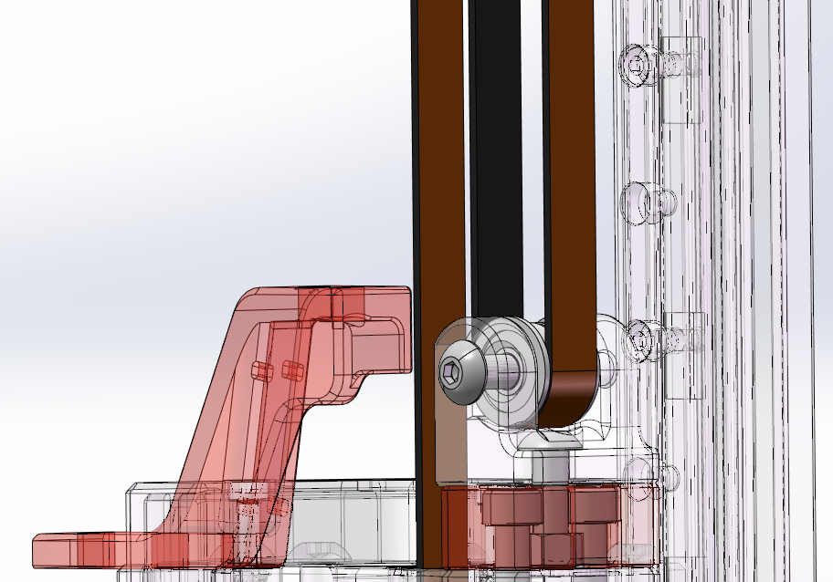
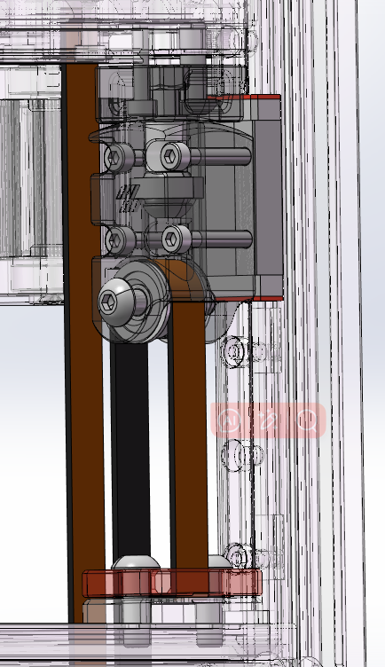
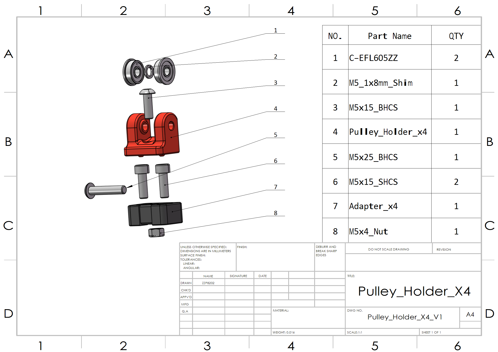
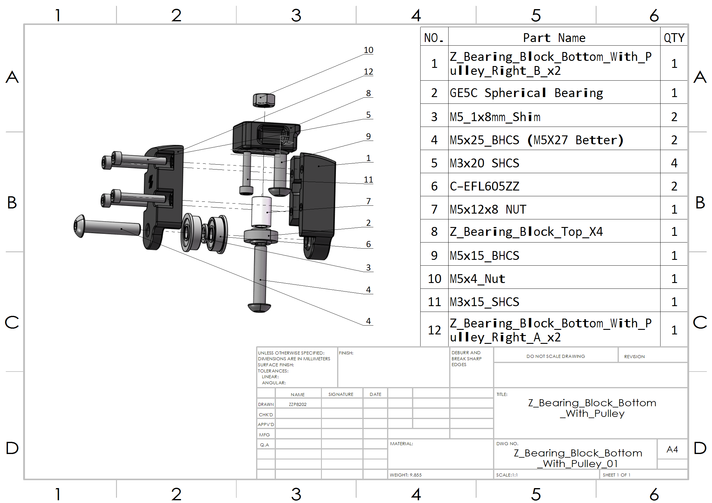

# Double_GEAR_ratio_Z

## Description: 
#### Double_GEAR_ratio_Z_belt_assembly_with_spherical_bearing_connection

## Objectives：
#### Reject Sagging
##### Enabling the Voron 2.4 Gantry to Defy Gravity

Voron 2.4 uses a belt-driven Z gantry structure. Voron 2.4 theoretically can achieve smaller layer lines compared to most 3D printers that use lead screw structures Due to the linearity of the lead screw affecting the stability of the horizontal position. However, with the original design's 4:1 gear ratio, the static torque of the stepper motor is insufficient to support the heavy gantry in the event of a power outage, especially when mods such as nozzle cleaner and klicky are added to the gantry, further increasing its weight. Since the rear weight of the gantry is significantly greater than the front, the gantry tilt is inevitable, requiring multiple calibrations before each print to achieve an acceptable parallelism with the print bed. To prevent the print head from hitting the platform during leveling, a higher leveling height is also necessary. In my opinion, a bigger issue is that in a power-off state, the gantry and the main frame might stretch, posing unknown deformation risks.

Previously, I modified the original G-code M84 to never turn off the Z motors unless an emergency stop or power cut occurs, to prevent significant gantry tilt.

Additionally, in the current setup, the connection between the gantry and the linear rails is in a 'semi-connected' state, requiring high calibration efforts and even risking disconnection during printing.

In my modification, I used GE5C ball joints to connect the gantry and the linear rails, which should provide a more stable structure. I also used a pulley system to increase the gear ratio to 8:1, allowing the gantry to maintain its position without external forces after a power outage. Practical tests show that only one leveling attempt is needed after a power outage without external influences, compared to the previous 3-4 attempts needed to complete the leveling.

## Image:

## Assemble Instructions:

#### Pulley_Holder

#### Bearing_Block_Bottom_With_Pulley

## Configuration Change:

Find the 'gear_ratio' parameter in 'stepper_z', 'stepper_z1',' stepper_z2', and ' stepper_z3':
Change from 4:1 to 8:1.

### Optional Configuration Change:

You may adjust the 'horizontal_move_z' parameter in '[quad_gantry_level] 'and '[bed_mesh]' to reduce the Z-axis lift height during operations, thereby increasing speed. I have change it to '10'.

## Bill of Materials (BOM)：
|NO.	|Category	|Part Name						|Qty				|Remark
|--|--|--|--|--|
|1	|Fasteners	|M3x15 SHCS 							|4				|		|
|2	|Fasteners	|M3x20 SHCS 							|16	                  	|	  |
|3	|Fasteners	|M5X25 BHCS 						|12				|M5X25 BHCS Better|
|4	|Fasteners	|M5x15 BHCS 							|24				|		|
|5	|Fasteners	|M5x15 SHCS 							|8				|		|
|6	|Fasteners	|M5xNUT								|8				|		|
|7	|Fasteners	|M5x12x8 NUT 						|4				|LEN:12mm,Out DIA:8mm	|
|8	|Fasteners	|M5X1x8 washer 						|8				|		|
|9	|Fasteners	|M5 T-nut HNTAJ5-5					|16				|		|
|10	|Motion		|F605zz  Bearing 						|16				|		|
|11	|Motion		|GE5C Spherical Bearing 				|4				|		|
|12	|Motion		|GT2 Open Belt LL-2GT-9 (9mm wide)		|Increase 50%		|		|
